## 什么是信号量
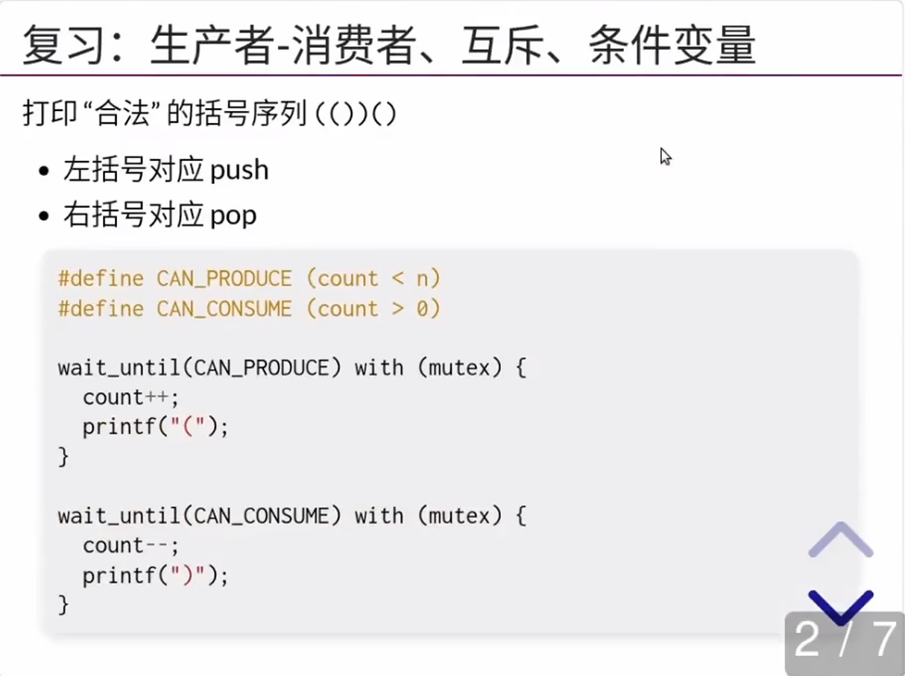
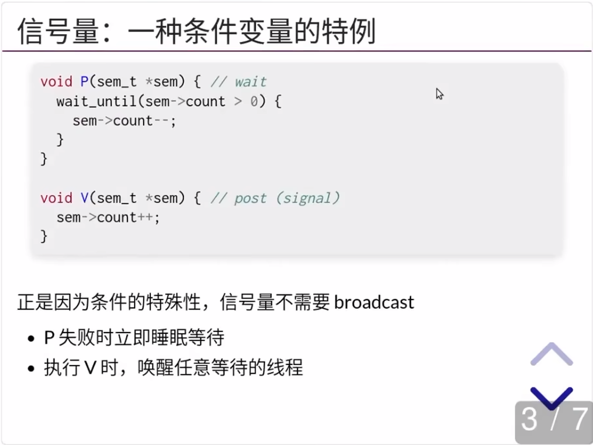
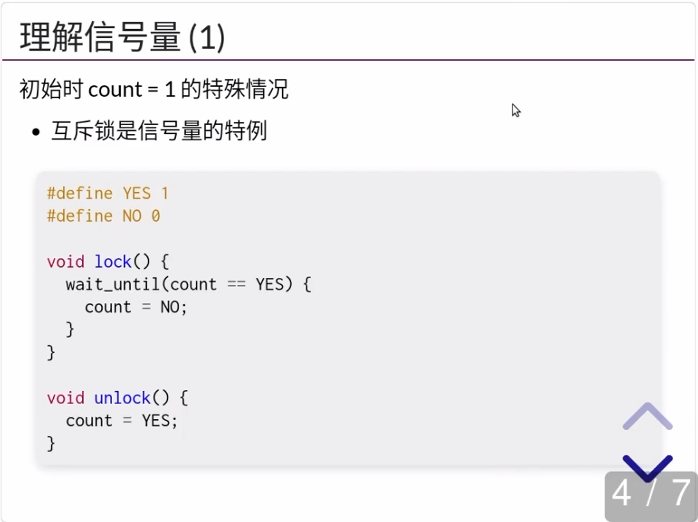
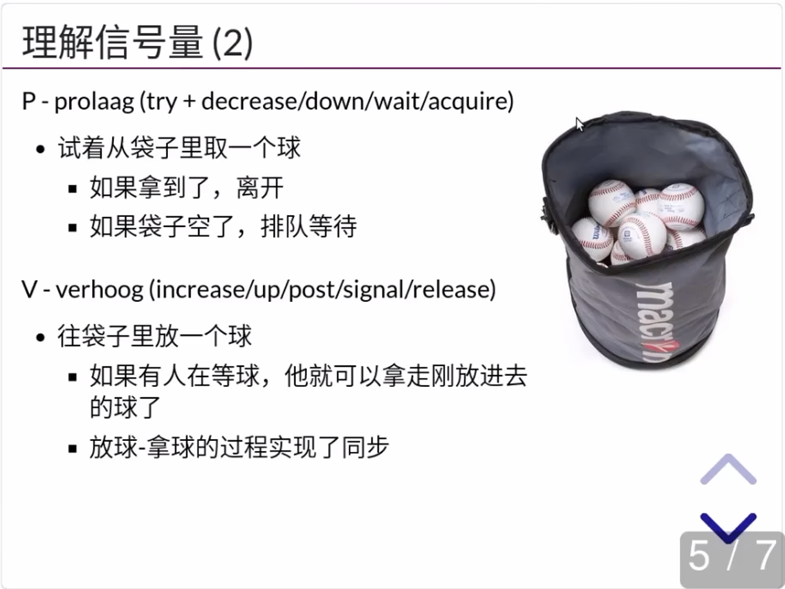
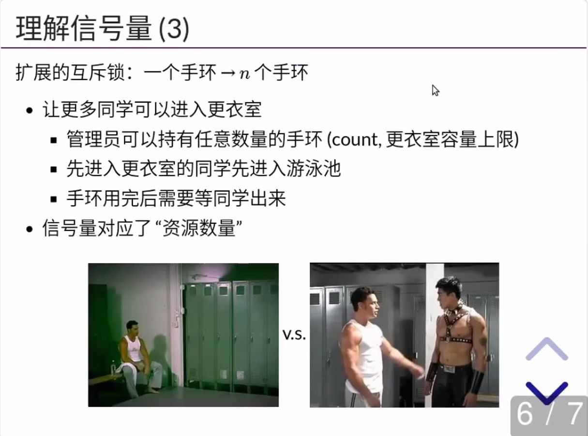
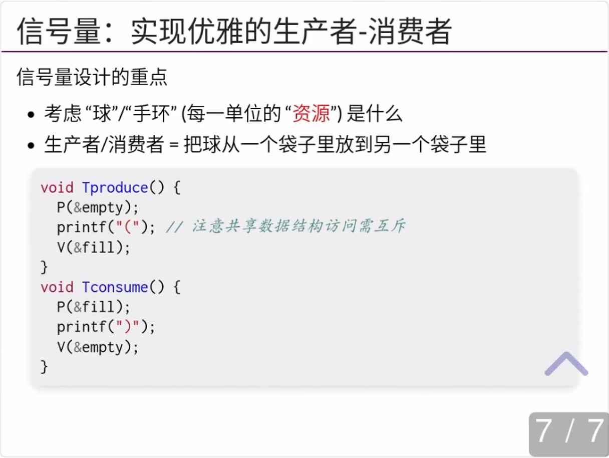

=== "示例：pc-sem"

    **代码示例：信号量解决生产者-消费者问题**

    在任意时刻，empty/fill 的数值就代表了当前还可以打印左括号/右括号的数量。而希望打印的线程，必须从相应的袋子里取走一个球。特别值得注意的是，我们总是把先把括号打印出来，再对相应的信号量执行 V 操作，这实现了生产者-消费者之间的同步。

=== "pc-sem.c"

    ``` c
    #include "thread.h"
    #include "thread-sync.h"

    sem_t fill, empty;

    void Tproduce() {
        while (1) {
            P(&empty);
            printf("(");
            V(&fill);
        }
    }

    void Tconsume() {
        while (1) {
            P(&fill);
            printf(")");
            V(&empty);
        }
    }

    int main(int argc, char *argv[]) {
        assert(argc == 2);
        SEM_INIT(&fill, 0);
        SEM_INIT(&empty, atoi(argv[1]));
        for (int i = 0; i < 8; i++) {
            create(Tproduce);
            create(Tconsume);
        }
    }
    ```

## 信号量适合解决什么问题
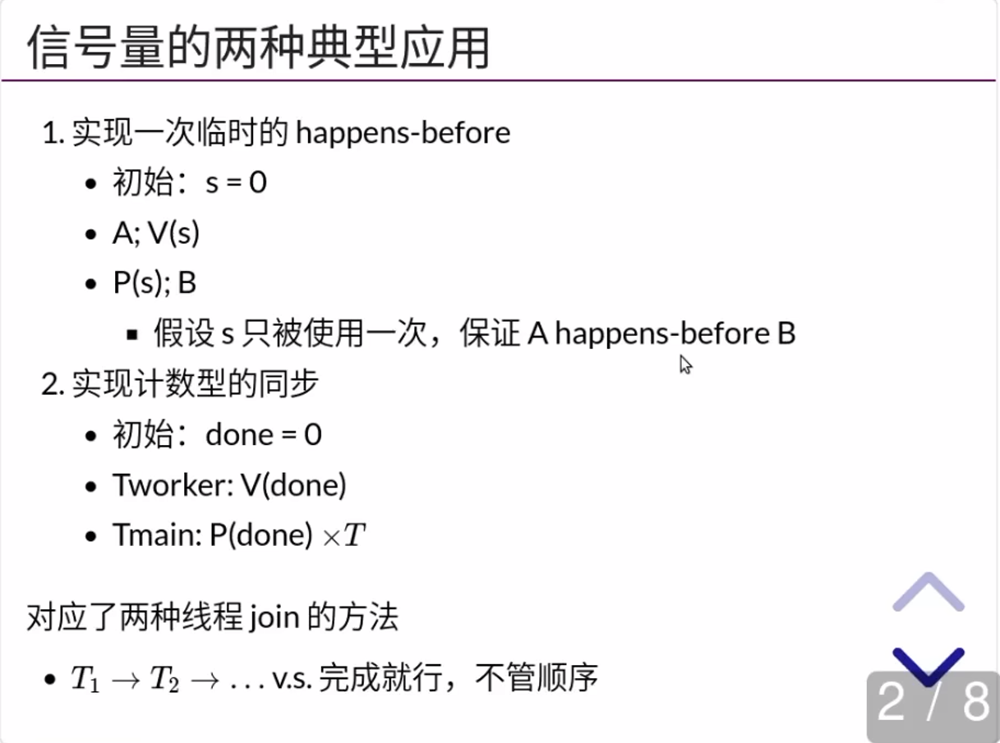

!!! warning "条件变量实现 happens-before"

    条件变量实现比信号量还是要麻烦一点的：

    B 如果还没执行到 `P(s)`，那么 A 发送 `cond_broadcast` 或者 `cond_signal` 就丢失了。

    还需要一个额外的变量去标记。

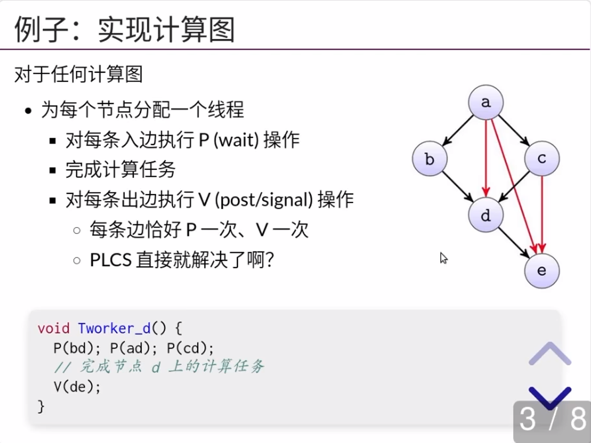
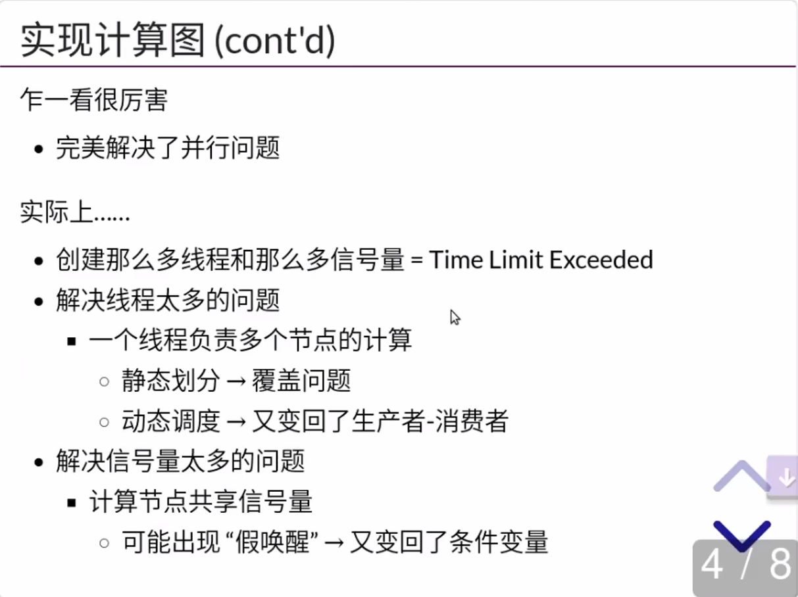

### 1.信号量实现线程 join

=== "示例：join-sem"

    **代码示例：信号量实现线程 join**

    一对 V-P 操作形成了 happens-before 关系，从而实现 “一件事等另一件事完成才能开始” 类型的同步。类似地，我们可以用信号量实现任意计算图的同步。相比于条件变量，由于 V 操作自带 count++，因此不用担心条件变量中唤醒丢失的情况。

=== "join-sem.c"

    ``` c
    #include "thread.h"
    #include "thread-sync.h"

    #define T 4
    #define N 10000000

    sem_t done;
    long sum = 0;

    void atomic_inc(long *ptr) {
        asm volatile(
            "lock incq %0"
            : "+m"(*ptr) : : "memory"
        );
    }

    void Tsum() {
        for (int i = 0; i < N; i++) {
            atomic_inc(&sum);
        }
        V(&done);
    }

    void Tprint() {
        for (int i = 0; i < T; i++) {
            P(&done);
        }
        printf("sum = %ld\n", sum);
    }

    int main() {
        SEM_INIT(&done, 0);
        for (int i = 0; i < T; i++) {
            create(Tsum);
        }
        create(Tprint);
    }
    ```

### 2.信号量实现同步习题

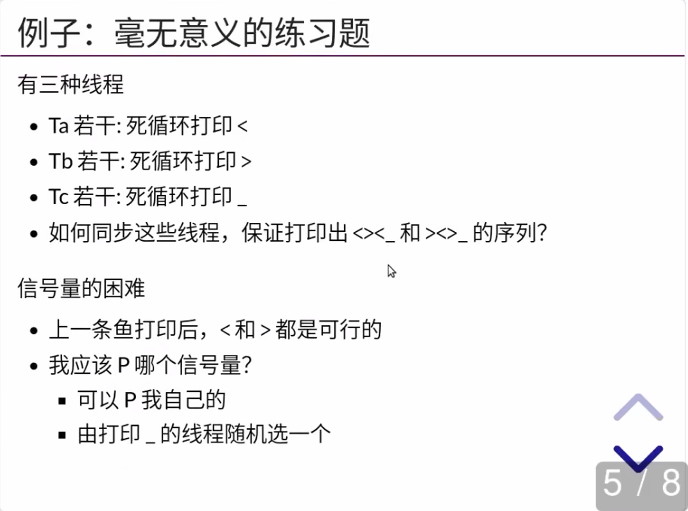

=== "示例：fish-sem"

    **代码示例：信号量实现同步习题**

    任何并发计算任务都可以看作计算图上的一个拓扑排序 (调度)。因此，我们用信号量实现 happens-before 在原则上能够解决任何 “调度由完成任务的线程控制” 类型的并发同步问题。

=== "fish-sem.c"

    ``` c
    #include "thread.h"
    #include "thread-sync.h"

    #define LENGTH(arr) (sizeof(arr) / sizeof(arr[0]))

    enum { A = 1, B, C, D, E, F, };

    struct rule {
        int from, ch, to;
    } rules[] = {
        { A, '<', B },
        { B, '>', C },
        { C, '<', D },
        { A, '>', E },
        { E, '<', F },
        { F, '>', D },
        { D, '_', A },
    };
    int current = A;
    sem_t cont[128];

    void fish_before(char ch) {
        P(&cont[(int)ch]);

        // Update state transition
        for (int i = 0; i < LENGTH(rules); i++) {
            struct rule *rule = &rules[i];
            if (rule->from == current && rule->ch == ch) {
                current = rule->to;
            }
        }
    }

    void fish_after(char ch) {
    int choices[16], n = 0;

    // Find enabled transitions
    for (int i = 0; i < LENGTH(rules); i++) {
        struct rule *rule = &rules[i];
        if (rule->from == current) {
            choices[n++] = rule->ch;
        }
    }

    // Activate a random one
    int c = rand() % n;
        V(&cont[choices[c]]);
    }

    const char roles[] = ".<<<<<>>>>___";

    void fish_thread(int id) {
        char role = roles[id];
        while (1) {
            fish_before(role);
            putchar(role);  // Not lock-protected
            fish_after(role);
        }
    }

    int main() {
        setbuf(stdout, NULL);
        SEM_INIT(&cont['<'], 1);
        SEM_INIT(&cont['>'], 0);
        SEM_INIT(&cont['_'], 0);
        for (int i = 0; i < strlen(roles); i++)
            create(fish_thread);
    }
    ```
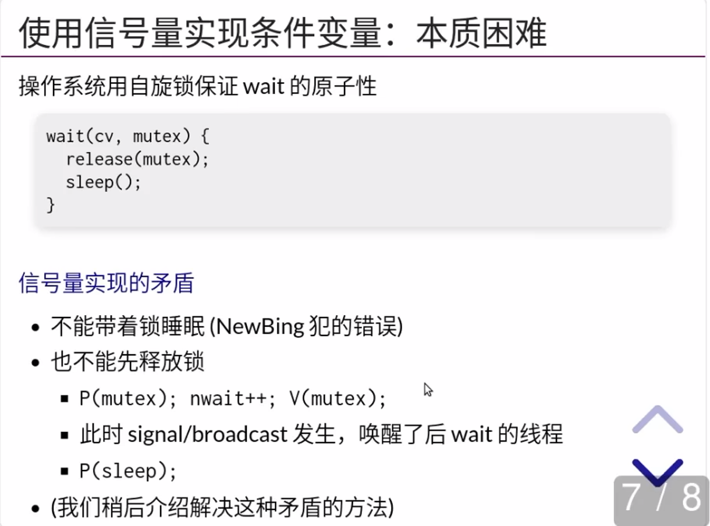
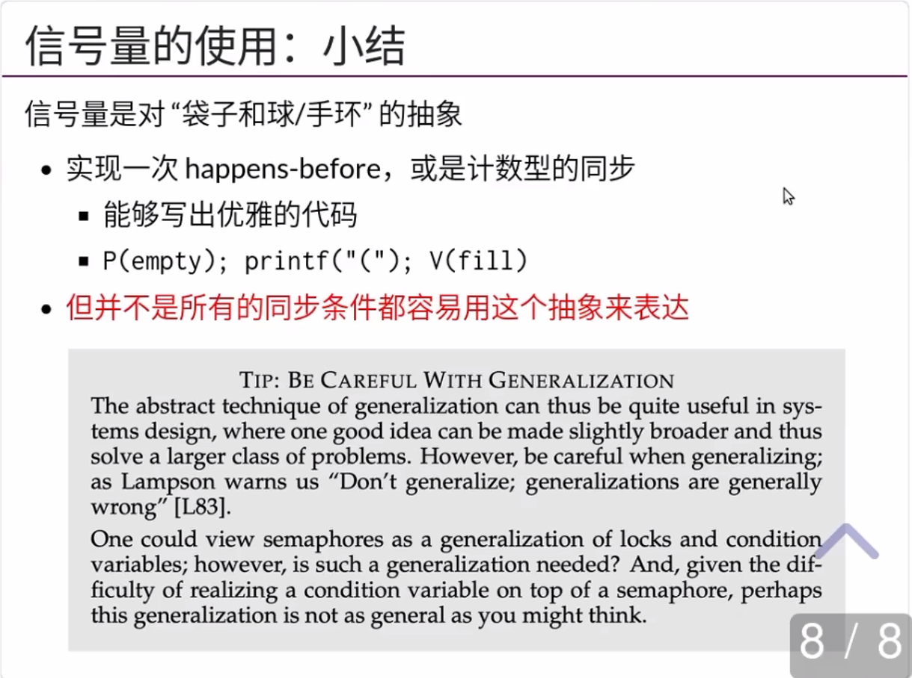

## 哲 ♂ 学家吃饭问题

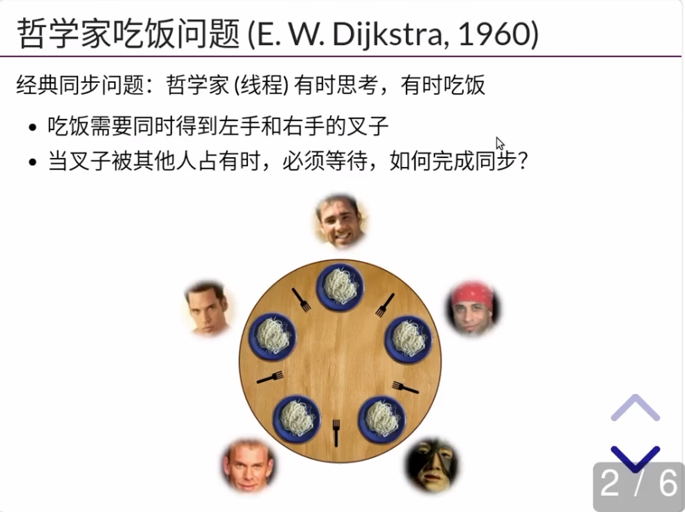

### 1.失败与成功的尝试

失败的尝试
- 把信号量当互斥锁：先拿一把叉子，再拿另一把叉子

成功的尝试 (万能的方法):

``` c
#define CAN_EAT (avail[lhs] && avail[rhs])
mutex_lock(&mutex);
while (!CAN_EAT)
  cond_wait(&cv, &mutex);
avail[lhs] = avail[rhs] = false;
mutex_unlock(&mutex);

mutex_lock(&mutex);
avail[lhs] = avail[rhs] = true;
cond_broadcast(&cv);
mutex_unlock(&mutex);
```

### 2.成功的尝试：信号量

Trick: ==死锁会在 5 个哲学家 “同时吃饭” 时发生==

破坏这个条件即可

- 保证任何时候至多只有 4 个人可以吃饭
  - 直观理解：大家先从桌上退出
    - 袋子里有 4 张卡
    - 拿到卡的可以上桌吃饭 (拿叉子)
    - 吃完以后把卡归还到袋子

任意 4 个人想吃饭，总有一个可以拿起左右手的叉子

- 教科书上有另一种解决方法 (lock ordering；之后会讲)


[^1]: [操作系统：设计与实现 (2023 春季学期)](https://jyywiki.cn/OS/2023/)
[^2]: [10. 并发控制：同步 (2)](https://jyywiki.cn/OS/2023/build/lect10.ipynb.html)
[^3]: [同步：信号量与哲♂学家吃饭问题 (信号量的正确打开方式) [南京大学2023操作系统-P10] (蒋炎岩)](https://www.bilibili.com/video/BV1xX4y1d7v2/?spm_id_from=333.788&vd_source=fa5dc8f5e6ad21c0ac06fd4bd377e40f)