## 死锁 (Deadlock)

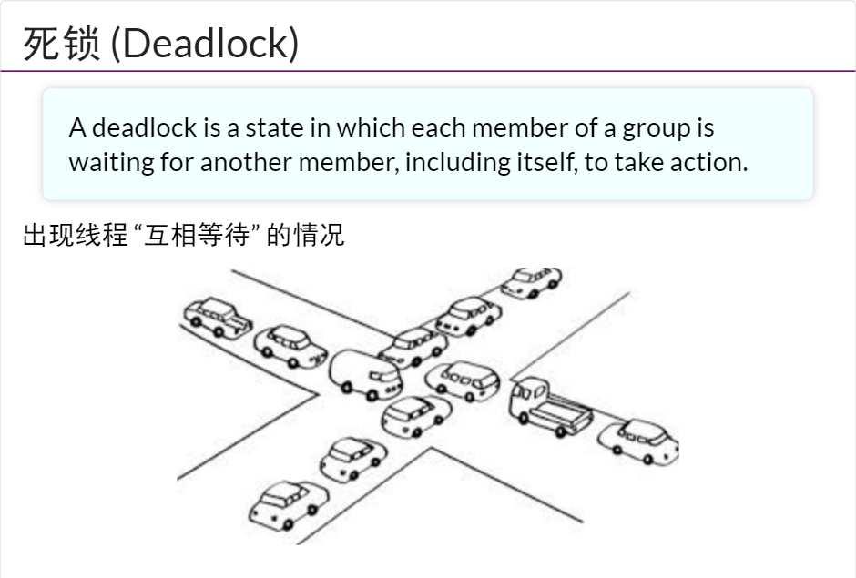
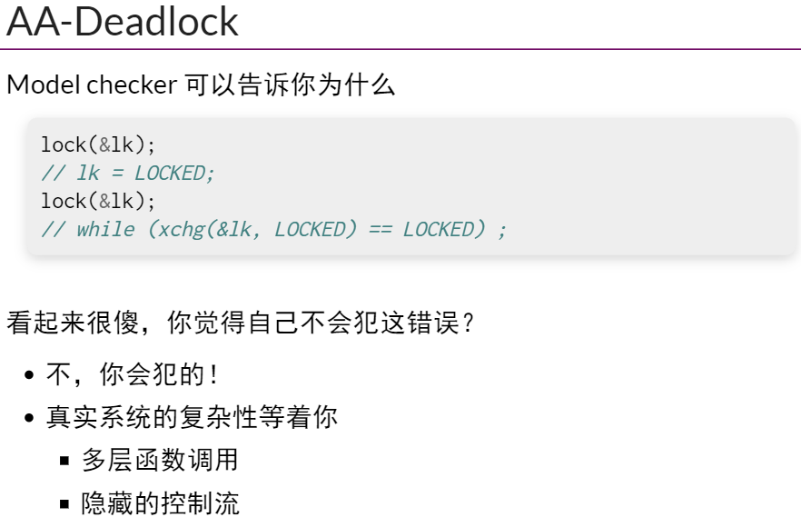
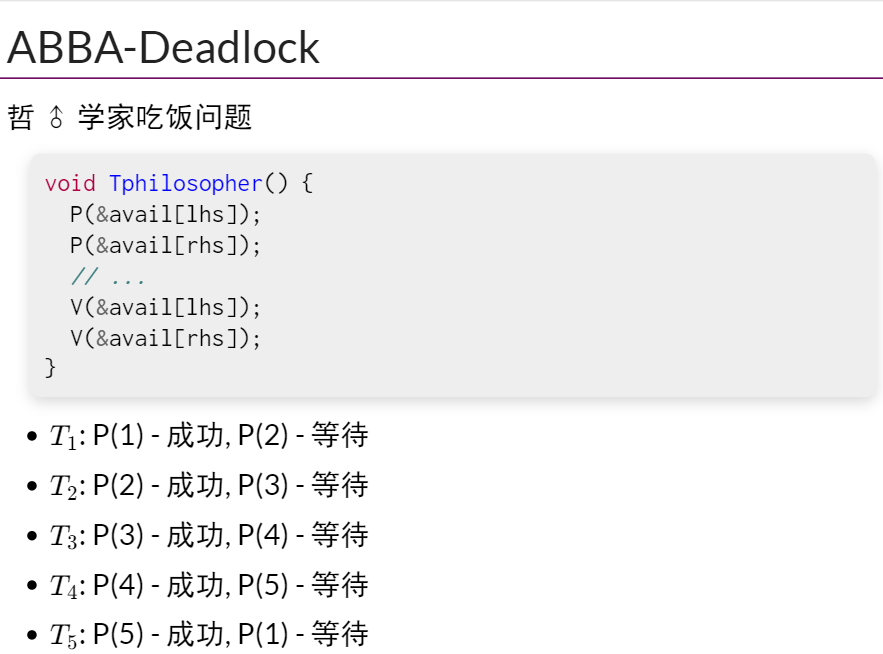
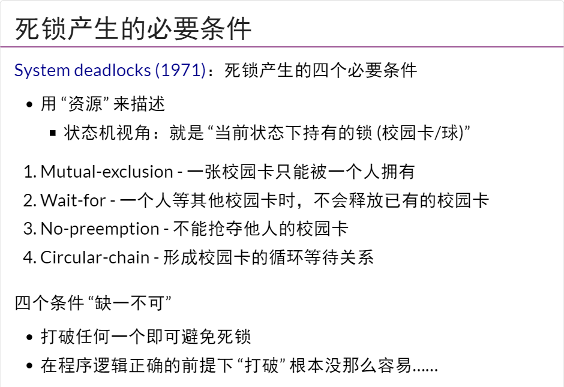

``` py title="model checker deadlock-aa.py"
def main():
  heap.table = '✅'

  # 1st lock()
  while True:
    seen = heap.table
    heap.table = '❌'
    sys_sched()
    if seen == '✅':
      break

  # 2nd lock()
  while True:
    seen = heap.table
    heap.table = '❌'
    sys_sched()
    if seen == '✅':
      break
```
## 数据竞争

!!! warning

    所以不上锁不就没有死锁了吗？


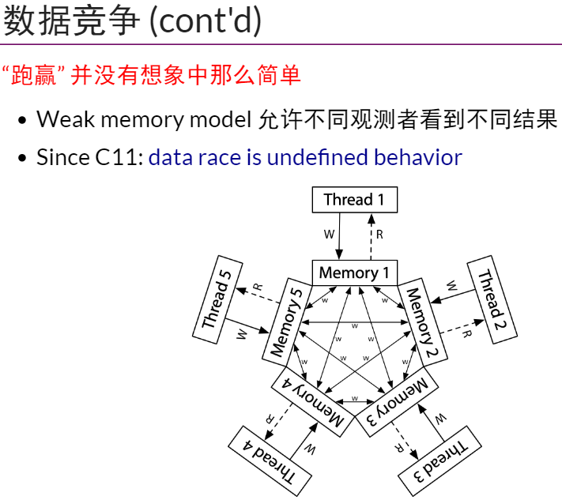
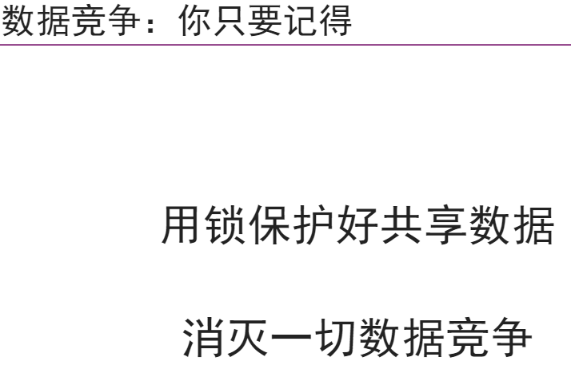
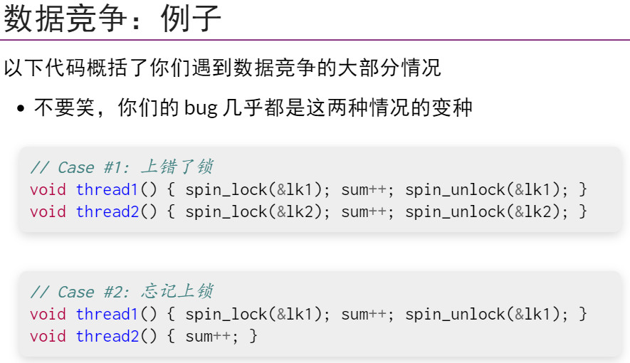


[Since C11: data race is undefined behavior](https://en.cppreference.com/w/c/language/memory_model)

=== "示例：peterson"

    **代码示例：Peterson 算法实现**

    在 `C/C++` 标准中，数据竞争是 `undefined behavior`。开发者有责任保证 `conflict` 的内存访问之间的 `happens-before` 关系，或是使用原子指令。虽然我们的实现使用了 `__sync_synchronize`，在编译器和 `x86` 处理器的 `specification` 不发生改变的前提下，代码本身是正确的，但这不是鼓励的编程方法。

=== "peterson.c"

    ``` c
    #include "thread.h"

    #define A 1
    #define B 2

    #define BARRIER __sync_synchronize()

    atomic_int nested;
    atomic_long count;

    void critical_section() {
        long cnt = atomic_fetch_add(&count, 1);
        int i = atomic_fetch_add(&nested, 1) + 1;
        if (i != 1) {
            printf("%d threads in the critical section @ count=%ld\n", i, cnt);
            assert(0);
        }
        atomic_fetch_add(&nested, -1);
    }

    int volatile x = 0, y = 0, turn;

    void TA() {
        while (1) {
            x = 1;                   BARRIER;
            turn = B;                BARRIER; // <- this is critcal for x86
            while (1) {
            if (!y) break;         BARRIER;
            if (turn != B) break;  BARRIER;
            }
            critical_section();
            x = 0;                   BARRIER;
        }
    }

    void TB() {
        while (1) {
            y = 1;                   BARRIER;
            turn = A;                BARRIER;
            while (1) {
            if (!x) break;         BARRIER;
            if (turn != A) break;  BARRIER;
            }
            critical_section();
            y = 0;                   BARRIER;
        }
    }

    int main() {
        create(TA);
        create(TB);
    }
    ```


## 原子性和顺序违反

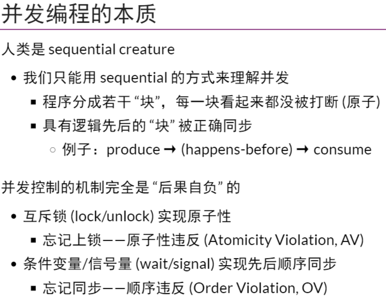
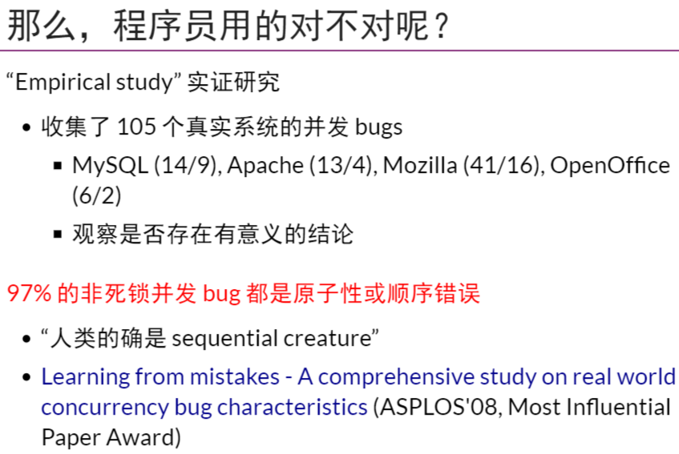
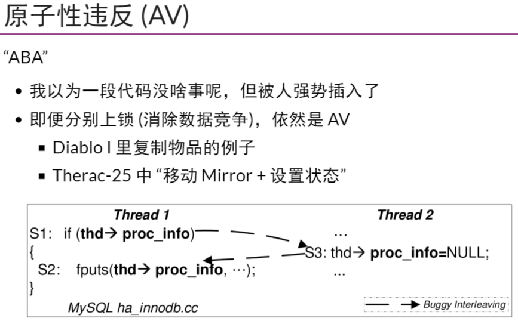
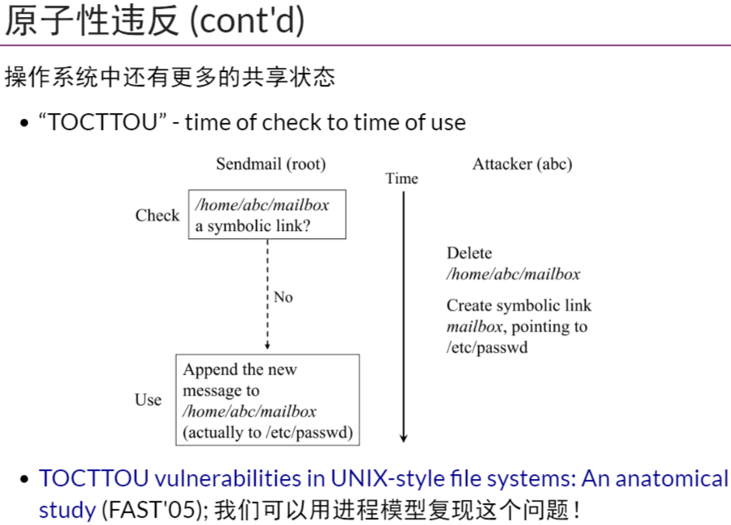
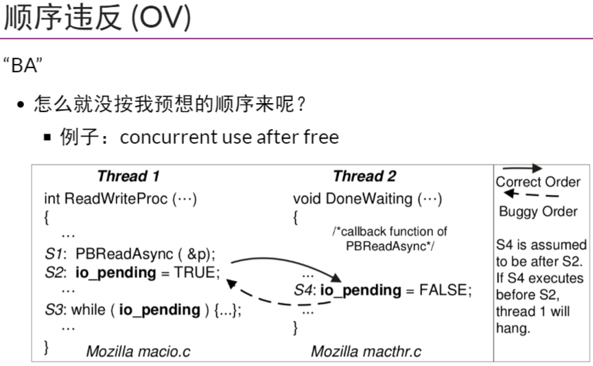

[Learning from mistakes - A comprehensive study on real world concurrency bug characteristics](https://dl.acm.org/doi/10.1145/1346281.1346323)

[TOCTTOU vulnerabilities in UNIX-style file systems: An anatomical study (FAST'05)](https://www.usenix.org/legacy/events/fast05/tech/full_papers/wei/wei.pdf)

=== "data race model checker"

    “原子性” 一直是开发者希望拥有的——对编程者而言，理想情况是一段代码的执行要么看起来在瞬间全部完成，要么好像完全没有执行过。代码中的副作用：共享内存写入、文件系统写入等，则都是实现原子性的障碍。因为 “原子性” 如此诱人，在计算机硬件/系统层面提供原子性的尝试一直都没有停止过：从数据库事务 (transactions, tx) 到软件和硬件支持的 [Transactional Memory](https://dl.acm.org/doi/10.1145/165123.165164) “[an idea ahead its time](https://news.brown.edu/articles/2012/04/transaction)” 到 [Operating System Transactions](https://dl.acm.org/doi/abs/10.1145/1629575.1629591)，直到今天我们依然没有每个程序员都垂手可得的可靠原子性保障。

    而保证程序的执行顺序就更困难了。Managed runtime 实现自动内存管理、channel 实现线程间通信等，都是减少程序员犯错的手段。

=== "tocttou.py"

    ``` py
    def main():
        sys_bwrite('/etc/passwd', ('plain', 'secret...'))
        sys_bwrite('file', ('plain', 'data...'))
        
        pid = sys_fork()
        sys_sched()
        
        if pid == 0:
            # attacker: symlink file -> /etc/passwd
            sys_bwrite('file', ('symlink', '/etc/passwd'))
        else:
            # sendmail (root): write to plain file
            filetype, contents = sys_bread('file')  # for check
            if filetype == 'plain':
            # TOCTTOU interval
            sys_sched()
            filetype, contents = sys_bread('file')  # for use
            match filetype:
                case 'symlink': filename = contents
                case 'plain': filename = 'file'
            sys_bwrite(filename, 'mail')
            sys_write(f'{filename} written')
            else:
            sys_write('rejected')

        # Outputs:
        # /etc/passwd written
        # file written
        # rejected
    ```
## Take-away Messages
人类本质上是 sequential creature，因此总是通过 “块的顺序执行” 这一简化模型去理解并发程序，也相应有了两种类型的并发 bugs：

- Atomicity violation，本应原子完成不被打断的代码被打断
- Order violation，本应按某个顺序完成的未能被正确同步

与这两类 bugs 关联的一个重要问题是数据竞争，即两个线程同时访问同一内存，且至少有一个是写。数据竞争非常危险，因此我们在编程时要尽力避免。


[^1]: [操作系统：设计与实现 (2023 春季学期)](https://jyywiki.cn/OS/2023/)
[^2]: [12. 真实世界的并发 Bug](https://jyywiki.cn/OS/2023/build/lect12.ipynb.html)
[^3]: [并发 Bug 分类（死锁、数据竞争、原子性/顺序违反）南京大学2023操作系统-P12 (蒋炎岩)](https://www.bilibili.com/video/BV1Bk4y1i7Xc/?spm_id_from=333.788&vd_source=fa5dc8f5e6ad21c0ac06fd4bd377e40f)