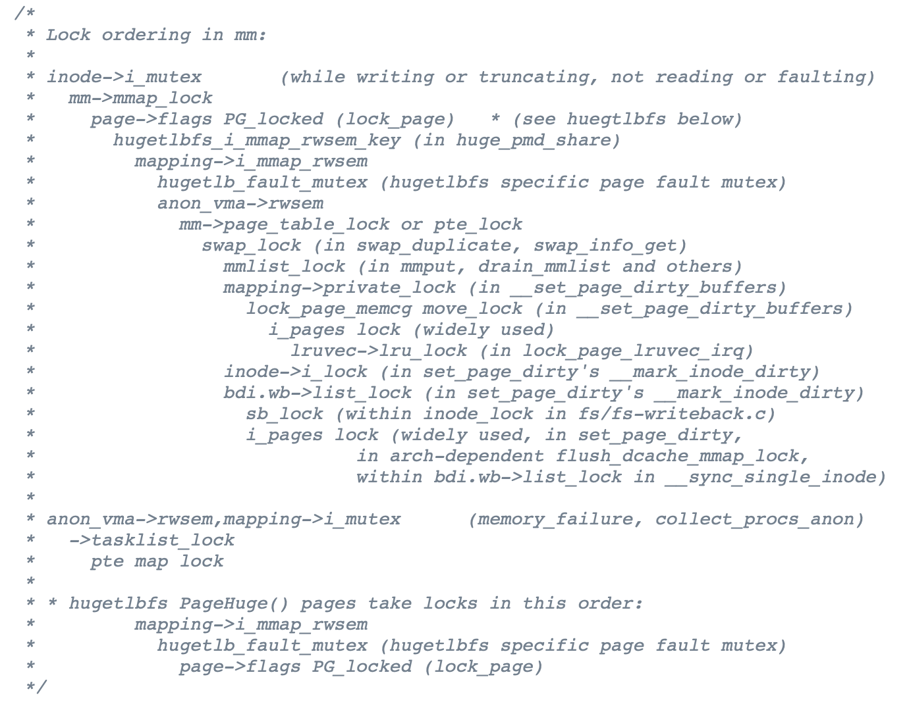

## Lock ordering
### 1.回顾：死锁产生的必要条件
[System deadlocks (1971)](https://dl.acm.org/doi/10.1145/356586.356588)：死锁产生的四个必要条件

用 “资源” 来描述

- 状态机视角：就是 “当前状态下持有的锁 (校园卡/球)”

1. Mutual-exclusion - 一张校园卡只能被一个人拥有
2. Wait-for - 一个人等其他校园卡时，不会释放已有的校园卡
3. No-preemption - 不能抢夺他人的校园卡
4. Circular-chain - 形成校园卡的循环等待关系

### 2.应对死锁：死锁产生的必要条件 (cont'd)
!!! tip "站着说话不腰疼的教科书："

    “理解了死锁的原因，尤其是产生死锁的四个必要条件，就可以最大可能地避免、预防和解除死锁。所以，在系统设计、进程调度等方面注意如何不让这四个必要条件成立，如何确定资源的合理分配算法，避免进程永久占据系统资源。此外，也要防止进程在处于等待状态的情况下占用资源。因此，对资源的分配要给予合理的规划。”

不能称为是一个合理的 argument

对于玩具系统/模型

- 我们可以直接证明系统是 deadlock-free 的

对于真正的复杂系统

- Bullshit

### 3.如何在实际系统中避免死锁？
四个条件中最容易达成的 **避免循环等待**

==Lock ordering==

- 任意时刻系统中的锁都是有限的
- 严格按照固定的顺序获得所有锁 (Lock Ordering)，就可以消灭循环等待
    - “在任意时刻获得 “最靠后” 锁的线程总是可以继续执行”
- 例子：修复哲学家吃饭问题

=== "示例：lock-ordering"

    **代码示例：使用 Lock Ordering 解决哲学家吃饭问题**

    只要每个线程上锁的顺序能被排成一个全序，在任何时候，获得 “最后一把锁” 的线程就总是能继续执行 (并在未来释放锁)。

=== "lock-ordering.c"

    ``` c
    #include "thread.h"
    #include "thread-sync.h"

    #define N 5

    sem_t avail[N];

    void Tphilosopher(int id) {
      int lhs = (id + N - 1) % N;
      int rhs = id % N;

      // Enforce lock ordering
      if (lhs > rhs) {
        int tmp = lhs;
        lhs = rhs;
        rhs = tmp;
      }

      while (1) {
        P(&avail[lhs]);
        printf("+ %d by T%d\n", lhs, id);
        P(&avail[rhs]);
        printf("+ %d by T%d\n", rhs, id);

        // Eat

        printf("- %d by T%d\n", lhs, id);
        printf("- %d by T%d\n", rhs, id);
        V(&avail[lhs]);
        V(&avail[rhs]);
      }
    }

    int main() {
      for (int i = 0; i < N; i++) {
        SEM_INIT(&avail[i], 1);
      }
      for (int i = 0; i < N; i++) {
        create(Tphilosopher);
      }
    }
    ```
### 4.Lock Ordering: 应用 


!!! tip "Emmm……"

    Textbooks will tell you that if you always lock in the same order, you will never get this kind of deadlock. {++Practice will tell you that this approach doesn't scale++}: when I create a new lock, I don't understand enough of the kernel to figure out where in the 5000 lock hierarchy it will fit.

    The best locks are encapsulated: they never get exposed in headers, and are never held around calls to non-trivial functions outside the same file. You can read through this code and see that it will never deadlock, because it never tries to grab another lock while it has that one. People using your code don't even need to know you are using a lock.

    —— [Unreliable Guide to Locking](https://www.kernel.org/doc/html/latest/kernel-hacking/locking.html) by Rusty Russell

## 防御性编程
即便是最容易发现、最容易预防的死锁类 bug，在实际的复杂系统中，想要使程序员能够正确遵守编程规范，也是十分困难的。因此，对于复杂的系统，我们必须总是假设程序员会花式犯错，最终才能得到高质量的系统。

### 1.回顾：调试理论

!!! tip ""

    程序 = 物理世界过程在信息世界中的投影

Bug = 违反程序员对 “物理世界” 的假设和约束

Bug 违反了程序的 specification

- 该发生的必须发生
- 不该发生的不能发生

Fault → Error → Failure

### 2.编程语言与 Bugs
编译器/编程语言

只管 “翻译” 代码，不管和实际需求 (规约) 是否匹配

- “山寨支付宝” 中的余额 balance
    - 正常人看到 0 → 18446744073709551516 都认为 “这件事不对” (“balance” 自带 no-underflow 的含义)

怎么才能编写出 “正确” (符合 specification) 的程序？

- 证明：Annotation verifier ([Dafny](https://dafny-lang.github.io/dafny/)), [Refinement types](https://dl.acm.org/doi/10.1145/113446.113468)
- 推测：Specification mining ([Daikon](http://plse.cs.washington.edu/daikon/))
- 构造：[Program sketching](https://link.springer.com/article/10.1007/s10009-012-0249-7)
- 编程语言的历史和未来
    - 机器语言 → 汇编语言 → 高级语言 → ==自然编程语言==

### 3.回到现实
今天 (被迫) 的解决方法

- 虽然不太愿意承认，但 ==始终假设自己的代码是错的==
- 因为机器永远是对的

然后呢？

- 首先，做好测试
- 检查哪里错了
- 再检查哪里错了
- 再再检查哪里错了
    - “防御性编程”
    - 把任何你认为可能 “不对” 的情况都检查一遍

### 4.防御性编程：实践
!!! tip ""

    把程序需要满足的条件用 assert 表达出来。

及早检查、及早报告、及早修复

- Peterson 算法中的临界区计数器 (assert(nest == 1);)
- 二叉树的旋转(assert(p->parent->left == p || p->parent->right == p);)
- AA-Deadlock 的检查
    - if (holding(&lk)) panic();
    - xv6 spinlock 实现示例

### 5.防御性编程和规约给我们的启发
你知道很多变量的含义

```c
#define CHECK_INT(x, cond) \
  ({ panic_on(!((x) cond), "int check fail: " #x " " #cond); })
#define CHECK_HEAP(ptr) \
  ({ panic_on(!IN_RANGE((ptr), heap)); })
```

变量有 “typed annotation”

- CHECK_INT(waitlist->count, >= 0);
- CHECK_INT(pid, < MAX_PROCS);
- CHECK_HEAP(ctx->rip); CHECK_HEAP(ctx->cr3);
- 变量含义改变 → 发生奇怪问题 (overflow, memory error, ...)

### 6.xv6 自旋锁实现

=== "示例：spinlock-xv6"

    **代码示例：xv6 自旋锁实现**

    xv6 自旋锁是防御性编程的典范。他假设锁的使用者会犯各种类型的错误，包括 AA 型死锁、double release、释放非本处理器持有的锁等。

=== "spinlock-xv6.c"

    ``` c
    #include "thread.h"
    #include "thread-sync.h"

    struct cpu {
      int ncli;
    };

    struct spinlock {
      const char *name;
      int locked;
      struct cpu *cpu;
    };

    __thread struct cpu lcpu;

    struct cpu *mycpu() {
      return &lcpu;
    }

    #define panic(...) \
      do { \
        fprintf(stderr, "Panic %s:%d ", __FILE__, __LINE__); \
        fprintf(stderr, __VA_ARGS__); \
        fprintf(stderr, "\n"); \
        abort(); \
      } while (0) \

    void
    initlock(struct spinlock *lk, char *name)
    {
      lk->name = name;
      lk->locked = 0;
      lk->cpu = 0;
    }

    // Pushcli/popcli are like cli/sti except that they are matched:
    // it takes two popcli to undo two pushcli.  Also, if interrupts
    // are off, then pushcli, popcli leaves them off.

    void
    pushcli(void)
    {
      // removes CPU-dependent code
      // eflags = readeflags();
      // cli();
      // if(mycpu()->ncli == 0)
      //   mycpu()->intena = eflags & FL_IF;
      mycpu()->ncli += 1;
    }

    void
    popcli(void)
    {
      // removes CPU-dependent code
      //if(readeflags()&FL_IF)
      //  panic("popcli - interruptible");
      if(--mycpu()->ncli < 0)
        panic("popcli");
      //if(mycpu()->ncli == 0 && mycpu()->intena)
      //  sti();
    }

    // Check whether this cpu is holding the lock.
    int
    holding(struct spinlock *lock)
    {
      int r;
      pushcli();
      r = lock->locked && lock->cpu == mycpu();
      popcli();
      return r;
    }

    // Acquire the lock.
    // Loops (spins) until the lock is acquired.
    // Holding a lock for a long time may cause
    // other CPUs to waste time spinning to acquire it.
    void
    acquire(struct spinlock *lk)
    {
      pushcli(); // disable interrupts to avoid deadlock.
      if(holding(lk))
        panic("acquire");

      // The xchg is atomic.
      while(atomic_xchg(&lk->locked, 1) != 0)
        ;

      // Tell the C compiler and the processor to not move loads or stores
      // past this point, to ensure that the critical section's memory
      // references happen after the lock is acquired.
      __sync_synchronize();

      // Record info about lock acquisition for debugging.
      lk->cpu = mycpu();
    }

    // Release the lock.
    void
    release(struct spinlock *lk)
    {
      if(!holding(lk))
        panic("release");

      lk->cpu = 0;

      // Tell the C compiler and the processor to not move loads or stores
      // past this point, to ensure that all the stores in the critical
      // section are visible to other cores before the lock is released.
      // Both the C compiler and the hardware may re-order loads and
      // stores; __sync_synchronize() tells them both not to.
      __sync_synchronize();

      // Release the lock, equivalent to lk->locked = 0.
      // This code can't use a C assignment, since it might
      // not be atomic. A real OS would use C atomics here.
      asm volatile("movl $0, %0" : "+m" (lk->locked) : );

      popcli();
    }

    struct spinlock lk;

    #define N 10000000

    long sum = 0;

    void Tworker(int tid) {
      lcpu = (struct cpu) { .ncli = 0 };
      for (int i = 0; i < N; i++) {
        acquire(&lk);
        sum++;
        release(&lk);
      }
    }

    int main() {
      initlock(&lk, "spinlock");
      for (int i = 0; i < 2; i++) {
        create(Tworker);
      }
      join();
      printf("sum = %ld\n", sum);
    }
    ```
=== "thread.h"

    ``` c
    #include <stdlib.h>
    #include <stdio.h>
    #include <string.h>
    #include <stdatomic.h>
    #include <assert.h>
    #include <unistd.h>
    #include <pthread.h>

    #define NTHREAD 64
    enum { T_FREE = 0, T_LIVE, T_DEAD, };
    struct thread {
      int id, status;
      pthread_t thread;
      void (*entry)(int);
    };

    struct thread tpool[NTHREAD], *tptr = tpool;

    void *wrapper(void *arg) {
      struct thread *thread = (struct thread *)arg;
      thread->entry(thread->id);
      return NULL;
    }

    void create(void *fn) {
      assert(tptr - tpool < NTHREAD);
      *tptr = (struct thread) {
        .id = tptr - tpool + 1,
        .status = T_LIVE,
        .entry = fn,
      };
      pthread_create(&(tptr->thread), NULL, wrapper, tptr);
      ++tptr;
    }

    void join() {
      for (int i = 0; i < NTHREAD; i++) {
        struct thread *t = &tpool[i];
        if (t->status == T_LIVE) {
          pthread_join(t->thread, NULL);
          t->status = T_DEAD;
        }
      }
    }

    __attribute__((destructor)) void cleanup() {
      join();
    }
    ```
=== "thread-sync.h"

    ``` c
    #include <semaphore.h>
    #include <pthread.h>

    // Spinlock
    typedef int spinlock_t;
    #define SPIN_INIT() 0

    static inline int atomic_xchg(volatile int *addr, int newval) {
      int result;
      asm volatile ("lock xchg %0, %1":
        "+m"(*addr), "=a"(result) : "1"(newval) : "memory");
      return result;
    }

    void spin_lock(spinlock_t *lk) {
      while (1) {
        int value = atomic_xchg(lk, 1);
        if (value == 0) {
          break;
        }
      }
    }
    void spin_unlock(spinlock_t *lk) {
      atomic_xchg(lk, 0);
    }

    // Mutex
    typedef pthread_mutex_t mutex_t;
    #define MUTEX_INIT() PTHREAD_MUTEX_INITIALIZER
    void mutex_lock(mutex_t *lk)   { pthread_mutex_lock(lk); }
    void mutex_unlock(mutex_t *lk) { pthread_mutex_unlock(lk); }

    // Conditional Variable
    typedef pthread_cond_t cond_t;
    #define COND_INIT() PTHREAD_COND_INITIALIZER
    #define cond_wait pthread_cond_wait
    #define cond_broadcast pthread_cond_broadcast
    #define cond_signal pthread_cond_signal

    // Semaphore
    #define P sem_wait
    #define V sem_post
    #define SEM_INIT(sem, val) sem_init(sem, 0, val)
    ```

!!! tip ""
    
    防御性编程对大型系统来说是至关重要的。如果没有适当的 assertions，调试代码会变得非常艰难。

## 运行时检查